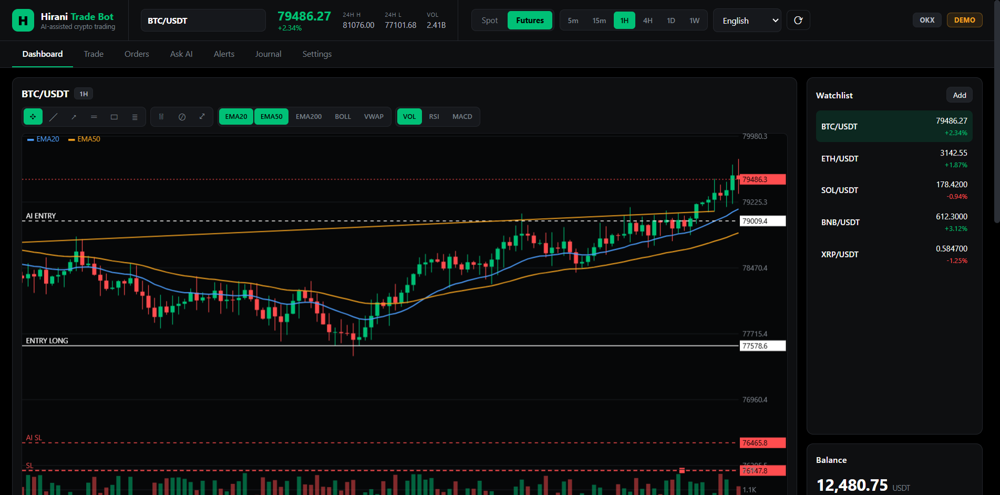
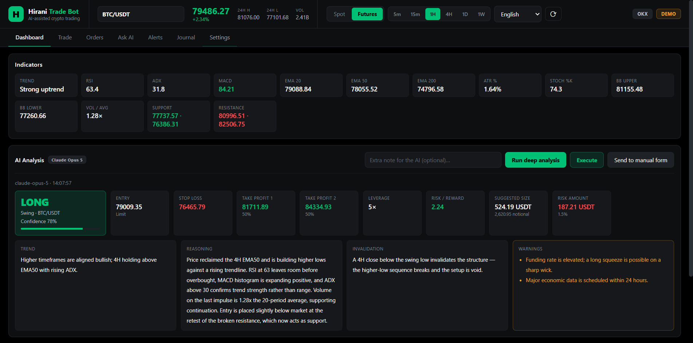
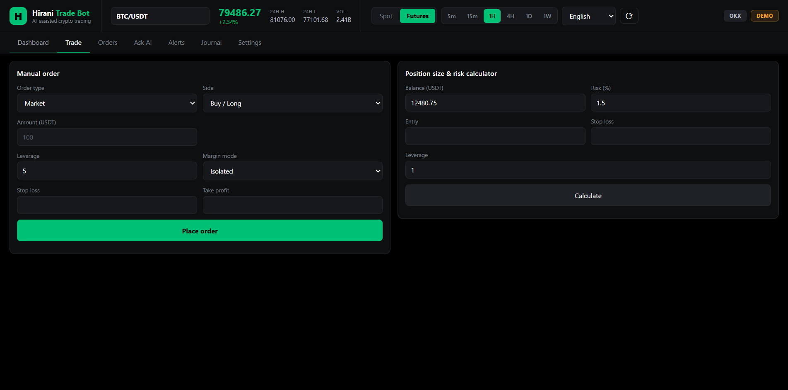
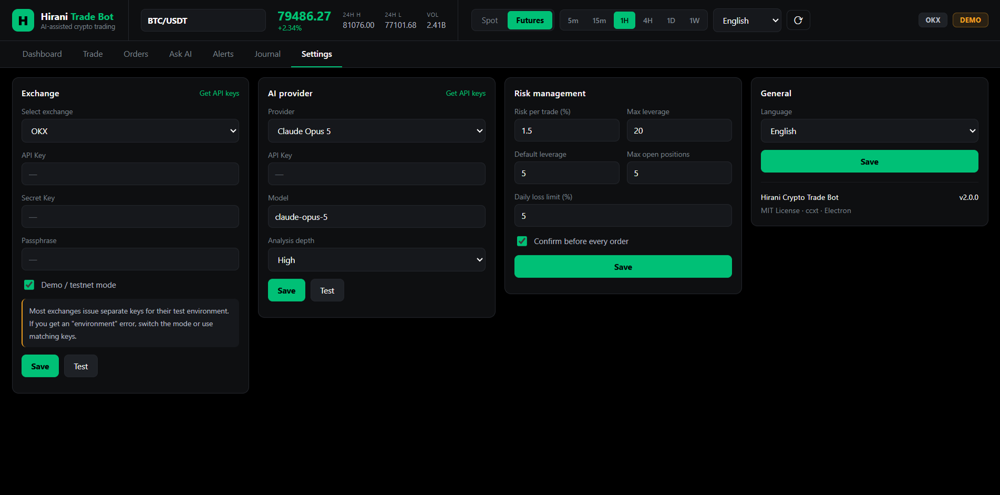

# Hirani Crypto Trade Bot

> AI-assisted crypto trading desktop app — multi-exchange spot & futures, with a full interactive chart and trade signals from Claude, OpenAI or Gemini.

<p align="center">
  
</p>

<p align="center">
  <a href="#-download">Download</a> ·
  <a href="#features">Features</a> ·
  <a href="#setup">Setup</a> ·
  <a href="#how-it-works">How it works</a> ·
  <a href="#security">Security</a> ·
  <a href="#disclaimer">Disclaimer</a>
</p>

<p align="center">
  <a href="https://github.com/hiranideve/Hirani-Crypto-Trade-Bot/releases/latest">
    
  </a>
  
  
</p>

---

## ⬇ Download

**No setup, no Node.js, no command line.** Everything the app needs is already inside the file — download, install, done.

| | File | Size | Notes |
|---|---|---|---|
| **Installer** *(recommended)* | [`HiraniCryptoTradeBot-2.0.0-win-x64.exe`](https://github.com/hiranideve/Hirani-Crypto-Trade-Bot/releases/latest/download/HiraniCryptoTradeBot-2.0.0-win-x64.exe) | ~104 MB | Installs to your PC, adds a desktop and Start-menu shortcut, and can be uninstalled normally |
| **Portable** | [`HiraniCryptoTradeBot-2.0.0-win-x64-portable.exe`](https://github.com/hiranideve/Hirani-Crypto-Trade-Bot/releases/latest/download/HiraniCryptoTradeBot-2.0.0-win-x64-portable.exe) | ~104 MB | Runs straight from the file — nothing is installed. Works from a USB stick |

**Requirements: Windows 10 or 11 (64-bit).** That's the whole list. There is nothing else to install — Node.js, Electron and every library are bundled inside the executable.

<details>
<summary><b>Windows shows "Windows protected your PC" — what do I do?</b></summary>

<br>

That's Windows SmartScreen. It appears for any application that hasn't been signed with a paid code-signing certificate (which costs several hundred dollars a year), not because anything is wrong with the file.

To continue: click **More info** → **Run anyway**.

If you would rather not trust the prebuilt file, you can build it yourself from the source in this repository — see [Build from source](#build-from-source). The result is identical.

</details>

<details>
<summary><b>macOS and Linux</b></summary>

<br>

Prebuilt binaries are currently published for Windows only. On macOS and Linux, build from source — it takes two commands:

```bash
npm install
npm run build:mac      # or: npm run build:linux
```

</details>

---

## Features

### AI trade signals
Press one button and the AI analyses the market across four timeframes (15m / 1H / 4H / 1D) and returns a complete, actionable plan:

- **Direction** — long, short, buy, wait or avoid
- **Entry price** with market/limit recommendation
- **Stop loss** placed behind real market structure, not an arbitrary number
- **Up to 3 take-profit targets** with allocation per level
- **Leverage**, **risk:reward ratio**, and **position size** already scaled to your balance and risk settings
- **Full written reasoning**, an invalidation condition, and warnings — in your language

One more click executes the whole plan on your exchange, including the attached stop loss and take profit.

### Choice of AI provider

| Provider | Default model | Notes |
|---|---|---|
| **Anthropic Claude** | `claude-opus-5` | Deepest analysis; supports adjustable analysis depth |
| **OpenAI** | `gpt-4o` | Fast, widely available |
| **Google Gemini** | `gemini-2.0-flash` | Generous free tier |

Any model name can be typed manually, so new models work without an app update.

### Choice of exchange

OKX · Binance · Bybit · Bitget · Gate.io · MEXC · KuCoin · HTX · Coinbase · Kraken

Spot and USDT-M perpetual futures, powered by [ccxt](https://github.com/ccxt/ccxt). Each exchange keeps its own stored API keys, so you can switch between them instantly.

### Professional chart

- Candlesticks with **scroll-to-zoom** and **drag-to-pan**
- Crosshair with live OHLCV readout
- Overlays: **EMA 20 / 50 / 200**, **Bollinger Bands**, **VWAP**
- Sub-panels: **Volume**, **RSI**, **MACD**
- **Drawing tools** — trend line, ray, horizontal line, rectangle, Fibonacci retracement
- Drawings are saved per symbol and stored as *(time, price)* pairs, so they stay anchored through zoom, pan and timeframe changes
- Your open position, liquidation price, pending orders and AI targets are drawn directly on the chart

### Position management

- **Drag the SL/TP handles on the chart** to move your stop loss or take profit — the change is sent to the exchange after confirmation
- Positions table with size, entry, mark price, leverage, liquidation price and live PnL
- Partial close at 25% / 50% / 75% / 100%
- Edit protections in a dedicated dialog

### Risk management

- Position size calculated from *balance × risk% ÷ stop distance* — never a fixed lot
- Configurable max leverage, max open positions and daily loss limit
- Confirmation dialog before every irreversible action
- The AI is hard-capped by your settings; it cannot exceed your maximum leverage or position size

### Also included

- **Price alerts** with desktop notifications
- **Activity journal** of every signal, order and modification
- **AI chat** for free-form market questions, with optional live market context
- **Demo / testnet mode** enabled by default

### Languages

**English · Kurdish (Sorani) · Arabic · Spanish · French** — switchable from the header at any time, with the whole layout mirroring for right-to-left languages. The AI writes its analysis in the selected language too.

---

## Screenshots

<p align="center">
  
  <br><em>A complete AI trade plan: verdict, entry, stop loss, targets, sizing and full reasoning</em>
</p>

<table>
  <tr>
    <td width="50%"></td>
    <td width="50%"></td>
  </tr>
  <tr>
    <td align="center"><em>Manual orders and the position size calculator</em></td>
    <td align="center"><em>Exchange, AI provider and risk settings</em></td>
  </tr>
</table>

---

## Build from source

Only needed if you want to modify the app or build it yourself — **users downloading a release do not need any of this.**

Requires **Node.js 18+** (20 LTS recommended).

```bash
git clone https://github.com/hiranideve/Hirani-Crypto-Trade-Bot.git hirani-crypto-trade-bot
cd hirani-crypto-trade-bot
npm install
npm start
```

To produce a distributable build:

```bash
npm run build           # Windows installer + portable
npm run build:mac       # macOS dmg
npm run build:linux     # Linux AppImage
```

Output lands in `dist/`. See [REQUIREMENTS.md](REQUIREMENTS.md) for the full dependency list and platform notes.

---

## Setup

After installing, three short steps get you running. The chart, indicators and market data already work with no keys at all — keys are only needed for trading and AI analysis.

### 1. Choose your language
Dropdown in the header, or **Settings → General**.

### 2. Connect an exchange

**Settings → Exchange**

1. Pick your exchange from the list
2. Click **Get API keys** to open the exchange's API page
3. Create a key with **trade** permission (never enable withdrawals)
4. Paste the API key, secret, and passphrase if the exchange requires one
5. Leave **Demo mode** on until you have tested the app
6. **Save**, then **Test**

> ⚠️ **Demo keys and live keys are different.** Most exchanges issue separate API keys for their test environment. If you see an *"API key does not match current environment"* error, either create a key inside the exchange's demo/testnet section, or turn demo mode off.

### 3. Connect an AI provider

**Settings → AI provider**

1. Pick Claude, OpenAI or Gemini
2. Click **Get API keys** to open the provider's console
3. Paste the key, optionally change the model
4. **Save**, then **Test**

### 4. Set your risk

**Settings → Risk management** — the defaults are conservative: 1.5% risk per trade, 20× max leverage, 5 max open positions.

---

## How it works

```
                   ┌──────────────────────────────┐
                   │  Exchange (ccxt)             │
                   │  candles · balance · orders  │
                   └──────────────┬───────────────┘
                                  │
                   ┌──────────────▼───────────────┐
                   │  Technical analysis          │
                   │  RSI MACD EMA ATR BB ADX     │
                   │  Stochastic VWAP pivots      │
                   │  across 15m / 1H / 4H / 1D   │
                   └──────────────┬───────────────┘
                                  │  JSON snapshot
                   ┌──────────────▼───────────────┐
                   │  AI provider                 │
                   │  Claude / OpenAI / Gemini    │
                   │  → structured trade signal   │
                   └──────────────┬───────────────┘
                                  │
                   ┌──────────────▼───────────────┐
                   │  Risk engine                 │
                   │  position sizing · validation │
                   │  caps leverage & size        │
                   └──────────────┬───────────────┘
                                  │
                   ┌──────────────▼───────────────┐
                   │  You confirm → order placed  │
                   └──────────────────────────────┘
```

The indicators are computed locally — the AI receives a compact numeric snapshot rather than raw candles, which keeps the analysis fast, cheap and consistent.

---

## Security

- **API keys never leave your machine.** They are encrypted at rest with your operating system's own credential store (DPAPI on Windows, Keychain on macOS, libsecret on Linux) and are only decryptable by the same user on the same device.
- **The UI has no direct access to Node, the filesystem or the network.** It runs sandboxed with context isolation, and communicates through a narrow, explicitly-listed IPC bridge.
- **A strict Content Security Policy** blocks any remote script or style.
- **Every irreversible action requires confirmation** — placing orders, changing stop losses, closing positions.
- **Withdrawal permission is never needed.** Create your API keys with trade access only.

Settings are stored in:

| OS | Path |
|---|---|
| Windows | `%APPDATA%\Hirani Crypto Trade Bot\` |
| macOS | `~/Library/Application Support/Hirani Crypto Trade Bot/` |
| Linux | `~/.config/Hirani Crypto Trade Bot/` |

---

## Project structure

```
electron/
  main.js         Main process: windows, IPC handlers, confirmations, alerts
  preload.js      The IPC bridge exposed to the UI
src/
  exchanges.js    Registry of supported exchanges and their quirks
  exchange.js     ccxt wrapper: market data, orders, positions, SL/TP
  indicators.js   Technical indicators, written from scratch
  analysis.js     Multi-timeframe snapshot builder
  ai.js           Claude / OpenAI / Gemini behind one interface
  risk.js         Position sizing and pre-trade validation
  store.js        Encrypted settings storage
  journal.js      Activity log
  drawings.js     Chart drawing persistence
ui/
  index.html      Layout
  styles.css      Theme
  i18n.js         Translations (5 languages)
  chart.js        The chart engine
  app.js          UI logic
```

No chart library, no UI framework, no analytics, no telemetry.

---

## Disclaimer

**This software is provided for educational purposes. Trading cryptocurrency carries substantial risk of loss.**

- The AI can be wrong. Its output is an opinion generated from technical indicators, not financial advice.
- Never trade money you cannot afford to lose.
- Test thoroughly in demo mode before using a live account.
- The authors accept no liability for any financial loss incurred through the use of this software.

You are solely responsible for every order this application places on your behalf.

---

## Contributing

Issues and pull requests are welcome at [github.com/hiranideve/Hirani-Crypto-Trade-Bot](https://github.com/hiranideve/Hirani-Crypto-Trade-Bot). Useful directions:

- Additional exchanges (the registry in `src/exchanges.js` makes this straightforward)
- More AI providers
- Additional languages — copy a block in `ui/i18n.js`
- More indicators or drawing tools
- Backtesting

---

## License

MIT — see [LICENSE](LICENSE).
